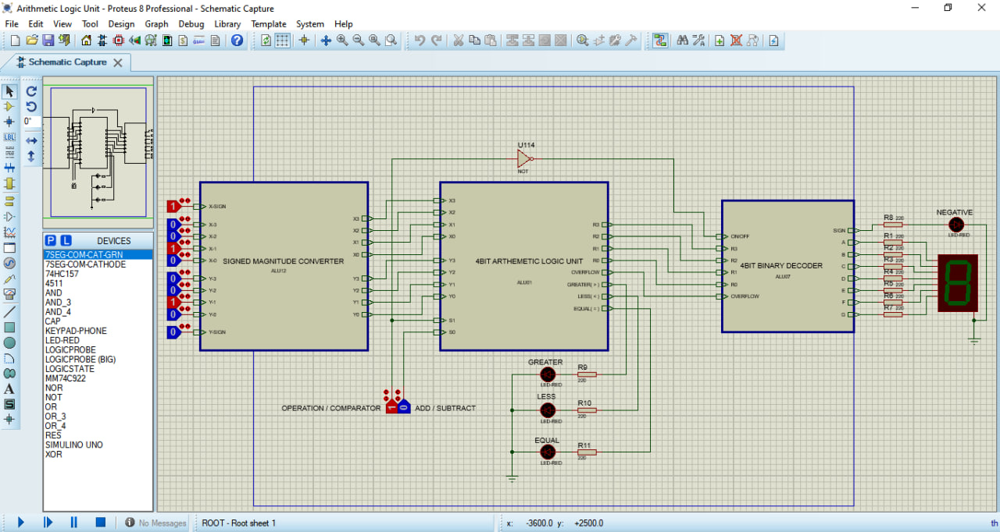
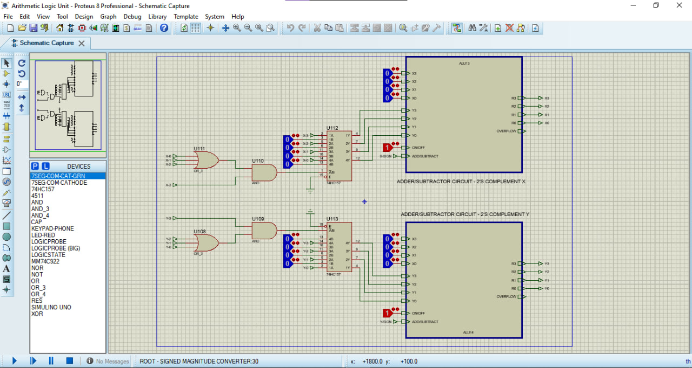
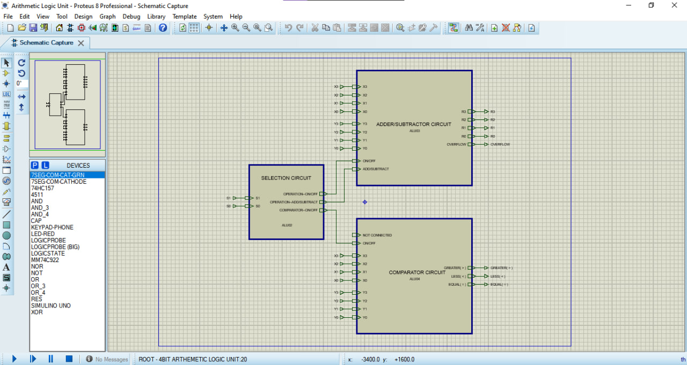
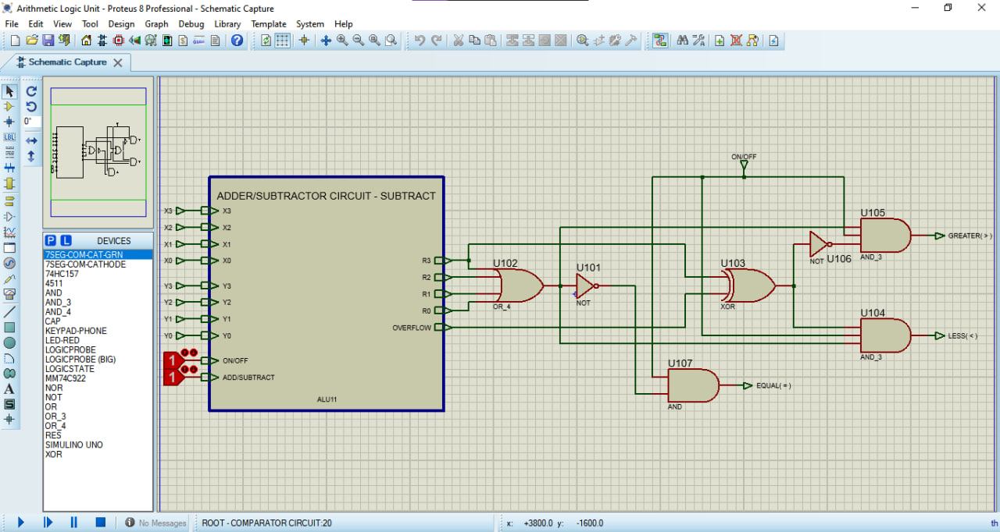
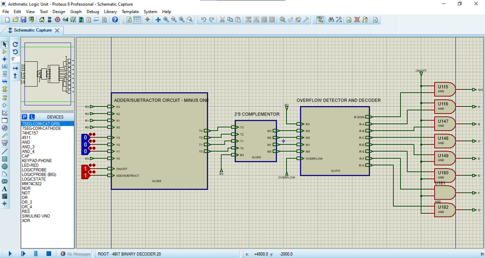
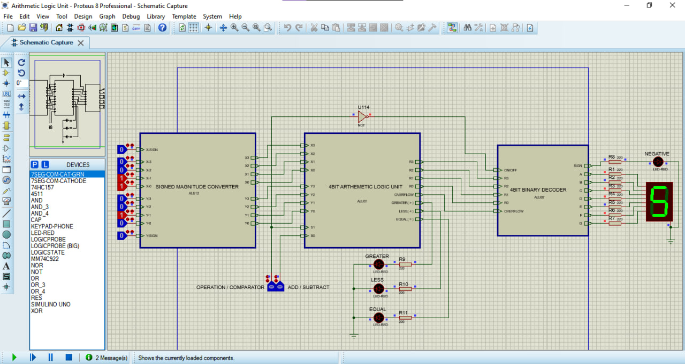

# 4-Bit Signed Arithmetic Logic Unit (ALU)

A digital logic project that implements a **4-bit signed Arithmetic Logic Unit (ALU)** capable of performing arithmetic and comparison operations using standard logic gates, multiplexers, decoders, and combinational logic circuits.

The system was designed and simulated in **Proteus** using a hierarchical architecture and supports signed numbers in the range **−8 to +7** using **2's complement representation**.

---

## Features

### Arithmetic Operations

- 4-bit signed addition
- 4-bit signed subtraction
- Overflow detection

### Comparison Operations

- Greater than (`A > B`)
- Less than (`A < B`)
- Equal to (`A = B`)

### Display System

- Common cathode 7-segment display
- Negative sign indication LED
- Overflow indication using `E` display

### Input Processing

- Signed magnitude input support
- Automatic conversion to 2's complement representation
- Invalid input detection and suppression

---

## Supported Number Range

The ALU operates on signed 4-bit numbers.

| Decimal Range | Binary Range |
| ------------- | ------------ |
| -8 to +7      | 1000 to 0111 |

Numbers outside the supported range are automatically rejected by the input validation circuit.

---

# System Architecture

The project is divided into three major hierarchical blocks:

```text
Signed Arithmetic Converter
            │
            ▼
      4-Bit ALU
            │
            ▼
 Binary Decoder & Display
```

---

## 1. Signed Arithmetic Converter

This block receives signed magnitude inputs from the user and converts them into 4-bit 2's complement values.

### Functions

- Input validation
- Range checking
- Signed magnitude to 2's complement conversion

### Internal Components

- Logic gates
- XOR gates
- 74HC157 Multiplexer
- Reused adder/subtractor circuit

---

## 2. 4-Bit Arithmetic Logic Unit

The ALU performs arithmetic and comparison operations.

### Inputs

| Signal | Description                    |
| ------ | ------------------------------ |
| A[3:0] | First operand                  |
| B[3:0] | Second operand                 |
| S0     | Add/Subtract selector          |
| S1     | Arithmetic/Comparator selector |

### Outputs

| Signal   | Description        |
| -------- | ------------------ |
| R[3:0]   | Arithmetic result  |
| OVERFLOW | Overflow indicator |
| GREATER  | A > B              |
| LESS     | A < B              |
| EQUAL    | A = B              |

---

### Selection Logic

| S1  | Mode       |
| --- | ---------- |
| 0   | Arithmetic |
| 1   | Comparator |

| S0  | Arithmetic Operation |
| --- | -------------------- |
| 0   | Addition             |
| 1   | Subtraction          |

---

### Overflow Detection

Overflow is detected using:

```text
Overflow = Carry_in(MSB) XOR Carry_out(MSB)
```

If overflow occurs:

```text
Display = E
```

instead of displaying an invalid result.

---

## 3. Binary Decoder & Display Unit

Converts the signed binary result into a human-readable decimal value.

### Functions

- Magnitude recovery for negative numbers
- Overflow indication
- Seven-segment decoding
- Sign indication

### Components

- Adder/Subtractor
- 2's Complementor
- CD4511 BCD-to-7 Segment Decoder
- 74HC157 Multiplexers
- Common Cathode 7-Segment Display

---

# Comparator Design

Instead of using a dedicated comparator IC, the design reuses the subtraction circuit.

The comparator evaluates:

```text
A - B
```

and determines:

```text
A > B
A < B
A = B
```

using the corrected sign and zero detection logic.

---

# Technologies Used

- Proteus Design Suite
- Digital Logic Design
- Hierarchical Schematic Design
- Combinational Logic Circuits

### Components

- Logic Gates
- XOR Gates
- AND Gates
- OR Gates
- NOT Gates
- 74HC157 Multiplexers
- CD4511 Decoder
- LEDs
- Common Cathode Seven-Segment Display

---

# Example Operations

| A   | B   | Operation | Result |
| --- | --- | --------- | ------ |
| 3   | 2   | Add       | 5      |
| -3  | 2   | Add       | -1     |
| 6   | 2   | Subtract  | 4      |
| 2   | 5   | Subtract  | -3     |
| 5   | 2   | Compare   | A > B  |
| -1  | 4   | Compare   | A < B  |
| 3   | 3   | Compare   | A = B  |

---

# Project Screenshots

## Top-Level Schematic



---

## Signed Arithmetic Converter



---

## 4-Bit ALU



---

## Comparator Circuit



---

## Binary Decoder and Display Unit



---

## Simulation Results



---

# Learning Outcomes

This project provided practical experience in:

- Signed binary arithmetic
- 2's complement representation
- Overflow detection
- Comparator design
- Seven-segment display interfacing
- Multiplexer-based control systems
- Hierarchical digital design
- Digital circuit simulation using Proteus

---

# Future Improvements

- Physical hardware implementation
- Keypad-based user input
- Multi-digit display support
- Additional logical operations (AND, OR, XOR, NOT)
- 8-bit ALU expansion
- FPGA implementation

---

# Author

**Jonna**
Electrical and Computer Engineering Student

---

## License

This project is released for educational purposes. Feel free to study, modify, and build upon the design.
