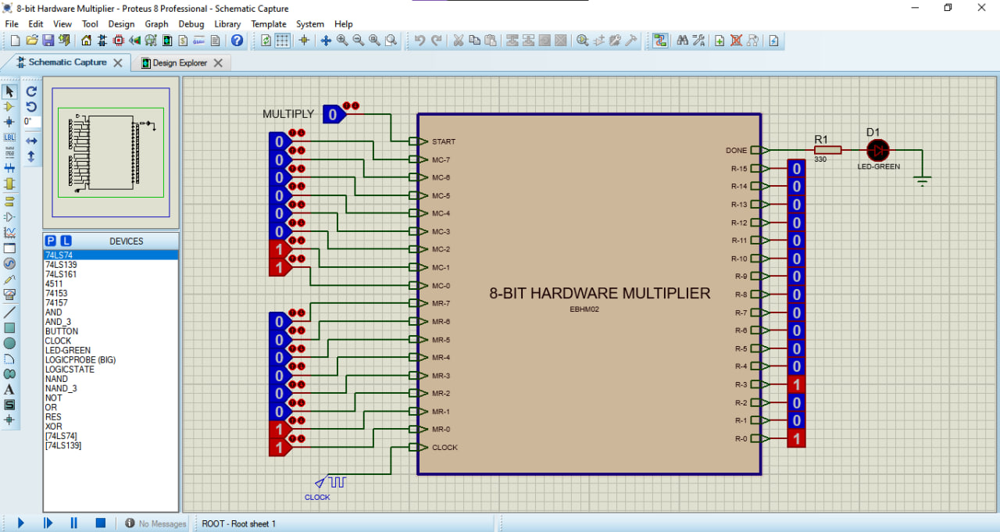
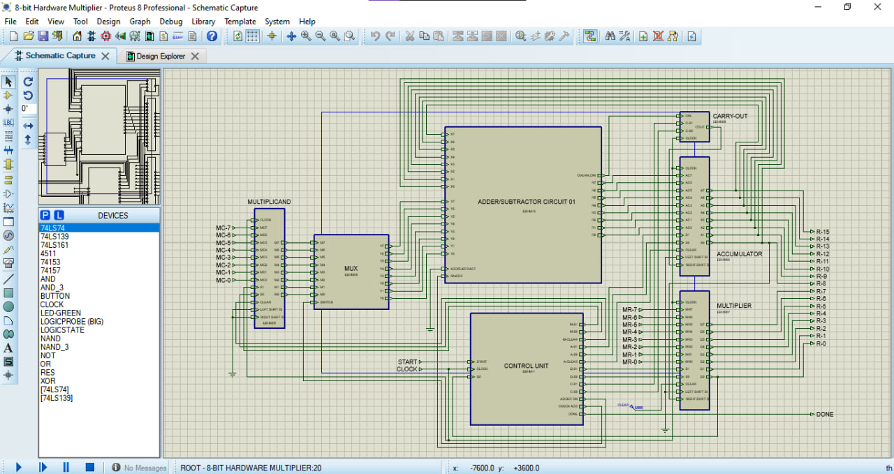
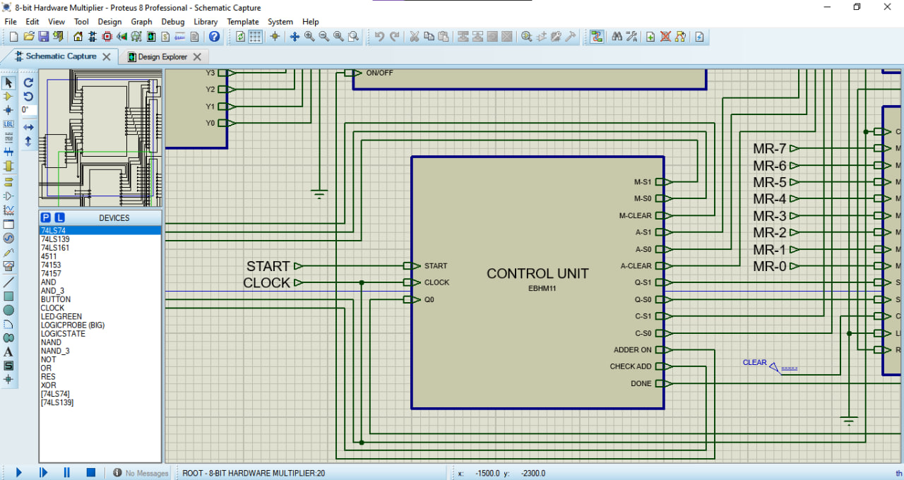
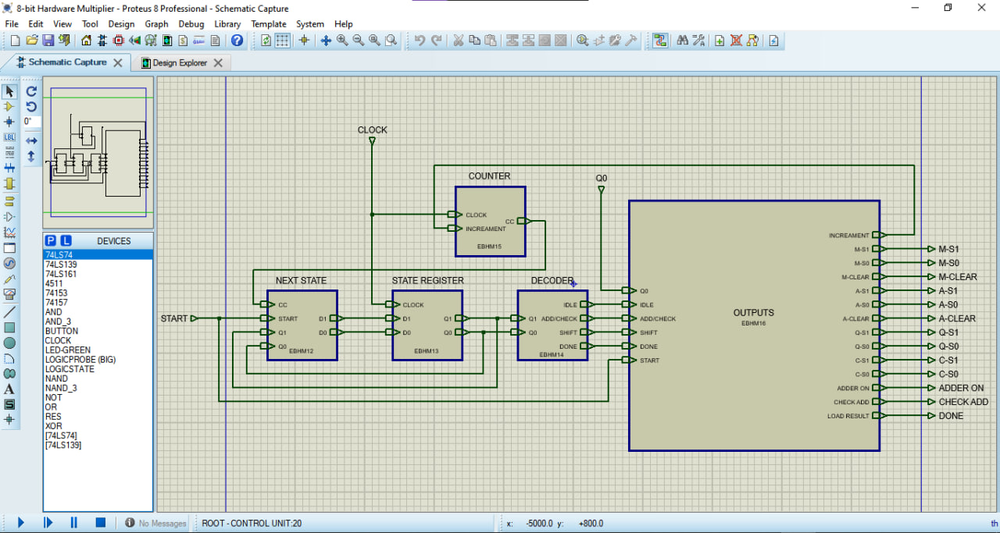
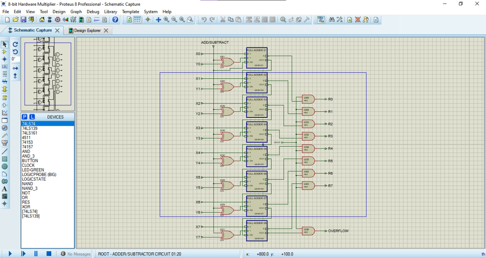
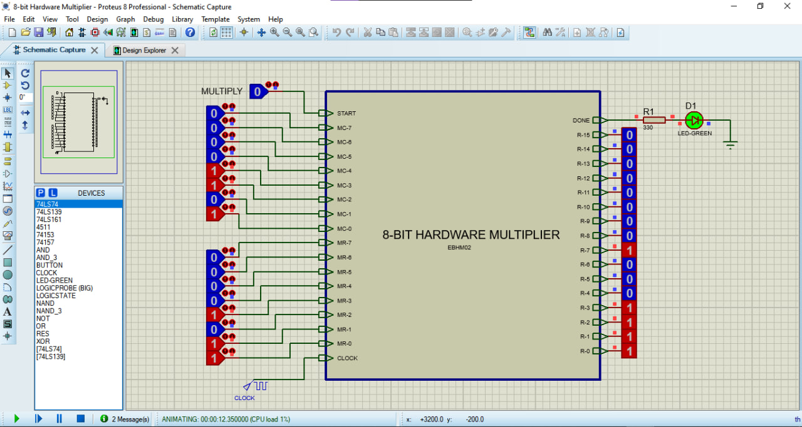

# 8-Bit Sequential Hardware Multiplier

A Register Transfer Level (RTL) implementation of an **8-bit sequential hardware multiplier** using the **Shift-and-Add multiplication algorithm**. The project was designed and simulated using **Proteus Design Suite 8.12** and demonstrates the interaction between a **Control Unit (FSM)** and a **Datapath** in a synchronous digital system.

---

## Project Overview

This project multiplies two unsigned 8-bit binary numbers and produces a 16-bit result.

Instead of using a large combinational multiplier, the design performs multiplication sequentially using the classic **Shift-and-Add algorithm**, requiring eight iterations to complete a multiplication operation.

### Top-Level Design



The design emphasizes:

- Register Transfer Level (RTL) Design
- Finite State Machine (FSM) Control
- Datapath and Control Path Separation
- Sequential Digital System Design
- Binary Arithmetic Implementation

---

## Features

- 8-bit × 8-bit multiplication
- 16-bit product output
- FSM-controlled operation
- Shift-and-Add multiplication algorithm
- Ripple Carry Adder implementation
- Universal Shift Register based datapath
- Iteration counter for operation control
- Done indicator LED
- Fully simulated in Proteus 8.12

---

## System Architecture

The multiplier is divided into two major sections:

### Datapath

The datapath contains:

- Multiplicand Register (M)
- Accumulator Register (A)
- Multiplier Register (Q)
- Carry Register (C)
- 2:1 Multiplexer
- 8-bit Ripple Carry Adder

### Datapath Screenshot



### Control Unit

The control unit contains:

- State Register
- Next State Logic
- 2×4 Decoder
- Iteration Counter
- Output Logic Generator

The control unit generates all control signals required for register loading, shifting, addition, counting, and completion detection.

### Control Unit Screenshot



---

## Shift-and-Add Algorithm

The multiplication process follows these steps:

1. Load Multiplicand and Multiplier.
2. Clear Accumulator and Carry Register.
3. Inspect the Least Significant Bit (Q₀) of the Multiplier.
4. If Q₀ = 1, add Multiplicand to Accumulator.
5. Store Carry-Out in Carry Register.
6. Shift the combined C-A-Q registers right by one bit.
7. Increment the iteration counter.
8. Repeat until eight iterations are completed.
9. Assert the Done signal.
10. Output the final 16-bit product.

---

## Finite State Machine (FSM)

The control unit is implemented as a 4-state Moore FSM.

| State     | Binary | Description                                 |
| --------- | ------ | ------------------------------------------- |
| Idle      | 00     | Waiting for Start signal                    |
| Check/Add | 01     | Checks Q₀ and performs addition if required |
| Shift     | 10     | Performs right shift and increments counter |
| Done      | 11     | Indicates multiplication completion         |

### FSM Diagram



---

## Register Control Encoding

All universal shift registers use the following control convention:

| S1  | S0  | Operation     |
| --- | --- | ------------- |
| 0   | 0   | Hold          |
| 0   | 1   | Shift Right   |
| 1   | 0   | Shift Left    |
| 1   | 1   | Parallel Load |

---

## Hardware Components Used

### Registers

- 8-bit Multiplicand Register
- 8-bit Accumulator Register
- 8-bit Multiplier Register
- 1-bit Carry Register

### Arithmetic Unit

- 8-bit Ripple Carry Adder
- Full Adder Based Design

### Adder Circuit



### Control Components

- FSM State Register
- Next-State Logic
- 2×4 Decoder
- Counter
- Multiplexer

---

## Inputs

| Input        | Description           |
| ------------ | --------------------- |
| Clock        | 8 Hz system clock     |
| Start        | Begins multiplication |
| Multiplicand | 8-bit input number    |
| Multiplier   | 8-bit input number    |

---

## Outputs

| Output        | Description                    |
| ------------- | ------------------------------ |
| Product[15:0] | 16-bit multiplication result   |
| Done          | Indicates operation completion |

---

## Example

### Input

Multiplicand:

```text
00001101 (13)
```

Multiplier:

```text
00001011 (11)
```

### Output

```text
0000000010001111 (143)
```

### Simulation Result



Since:

```text
13 × 11 = 143
```

---

## Project Structure

```text
8-Bit Hardware Multiplier
│
├── Control Unit
│   ├── State Register
│   ├── Next State Logic
│   ├── Decoder
│   ├── Counter
│   └── Output Logic
│
├── Datapath
│   ├── Multiplicand Register
│   ├── Accumulator Register
│   ├── Multiplier Register
│   ├── Carry Register
│   ├── Multiplexer
│   └── Ripple Carry Adder
│
└── Top-Level Integration
```

---

## Simulation Environment

**Software:** Proteus Design Suite 8.12

The complete design was implemented and verified through simulation using logic probes, LEDs, and clock-driven state transitions.

---

## Learning Outcomes

This project demonstrates:

- RTL Design Methodology
- Sequential Circuit Design
- FSM-Based Control Systems
- Binary Multiplication Hardware
- Register Transfer Operations
- Datapath and Control Path Integration
- Digital System Verification

---

## Future Improvements

Possible extensions include:

- Signed Multiplication Support
- Booth's Multiplication Algorithm
- Carry Look-Ahead Adder
- 16-bit or 32-bit Multiplier Versions
- Verilog/VHDL Implementation
- FPGA Deployment
- Performance Optimization

---

## Author

Electrical and Computer Engineering Student

Designed as part of a Digital Logic Design / Computer Architecture project using Proteus Design Suite 8.12.
